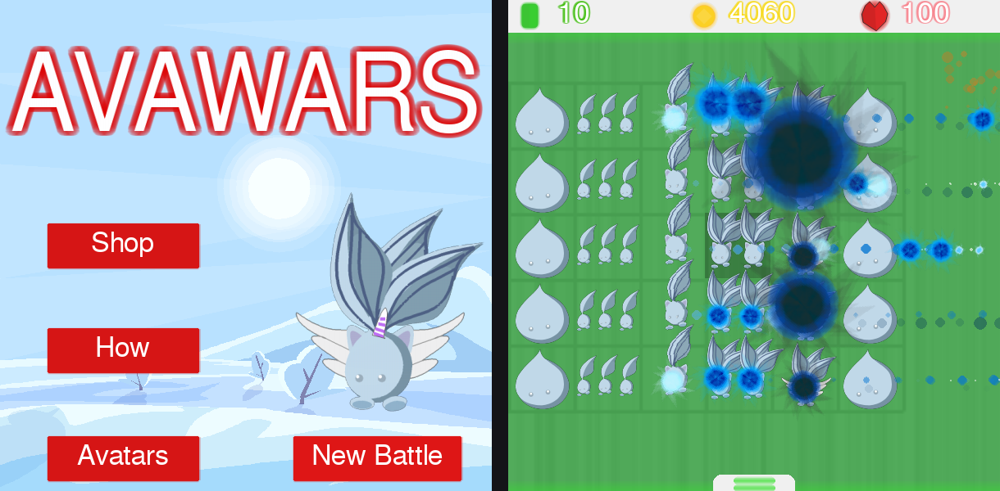

# avawars
### My 2021 Khan Academy plants vs. zombies tower defence game, rescued from ProcessingJS into Python/pygame. Every vector-drawn sprite intact, playable in-browser via WebAssembly.
=======
# AVAWARS — Python port



A faithful Python/pygame port of **AVAWARS**, the Plants-vs-Zombies-style tower
defence game originally written in Khan Academy ProcessingJS by
*Corin Fist Productions* (7–12 April 2021).
[see original here](https://www.khanacademy.org/computer-programming/avawars/6720649461448704)

Every pixel is still drawn from the original vector code. transcribed into Python and baked to textures at load time.

---

## Play it
[play here!](https://RobertCloudDev.github.io/avawars/)

---

## Controls

| Input | Action |
|---|---|
| **Left click** (bottom bar) | Pick an avatar to place — cost shown on hover |
| **Left click** (grid) | Place the held avatar / select a placed one |
| **Space** or **Delete** | Sell the selected avatar (refunds ~83%) |
| **Right click** | Drop whatever is in hand / deselect |
| **Mouse to bottom edge** | Slides the shop bar up |
| **Space** (Avatars screen) | Next page of the bestiary |
| **Hold P** | Hidden promo poster |
| **Esc** | Quit (desktop only) |

Survive **300 in-game seconds** and you win. Let five Vortans reach the left
edge and you lose. Emeralds drop rarely; spend them in the Shop on starting
gold and gold-per-kill, and those upgrades persist between battles.

---

## Layout

```
main.py        entry point; async loop so the same file runs under pygbag
pshim.py       Processing→pygame shim (degrees, beginShape/bezierVertex, matrix stack)
art.py         all 26 vector drawing routines, transcribed from the original
assets.py      bakes each routine into a Surface, one per frame, during loading
entities.py    particles, bullets, enemies, tiles, selection bar, Admin
ui.py          glow text, neon buttons, spin transition, HUD strips
scenes.py      the eight scenes + dispatcher
state.py       the globals ProcessingJS kept at top level
```

Read `EVALUATION.md` for the analysis of the original — what the image-caching
trick bought, which bugs survived the port, and which didn't.

---

## Fidelity notes

Deviations from the original are marked `# CHANGED:` in the source. The
substantive ones:

* **Assets bake off-screen.** The original drew each asset onto the visible
  canvas and grabbed it with `get()`, which is why the loading screen exists.
  Here they render to off-screen surfaces at 2–3× and downscale, so they're
  antialiased and not clipped to the canvas rectangle.
* **Text auto-condenses.** The layout was tuned for Trebuchet MS. Any fallback
  font is wider, so over-wide blocks are squeezed horizontally rather than
  running off screen.
* **Lists aren't mutated mid-iteration.** The original spliced from `en`/`gl`
  inside `for…in` loops, silently skipping an entity per removal. Fixed.
* **Particles are soft-capped** at 900 so a late wave can't stall the frame.
* **Deterministic art.** The noise fields in the fire backdrops were baked once
  per run in the original; here they're seeded, so every player sees the same art.

Original bugs kept on purpose, because they *are* the game's balance:
seed-tier Vortans deal `random()` damage (0–1); an emerald only drops when the
roll lands on exactly 30, which makes tier-5 enemies a guaranteed gem and tier-1
enemies never one; enemy bullets can tunnel past a tile's 10-pixel hit radius.

---

Disclaimer: This port was generated by Claude Code and evaluated by yours truly. The original code and project can be seen [here](https://www.khanacademy.org/computer-programming/avawars/6720649461448704). To my knowledge, everything has been faithfully copied to its exact properties, Aside from a couple visual errors that I'm willing to dismiss. 

Original program © Corin Fist Productions, 2021.
>>>>>>> 3f62715 (Python/pygame port of AVAWARS (2021 ProcessingJS original))


